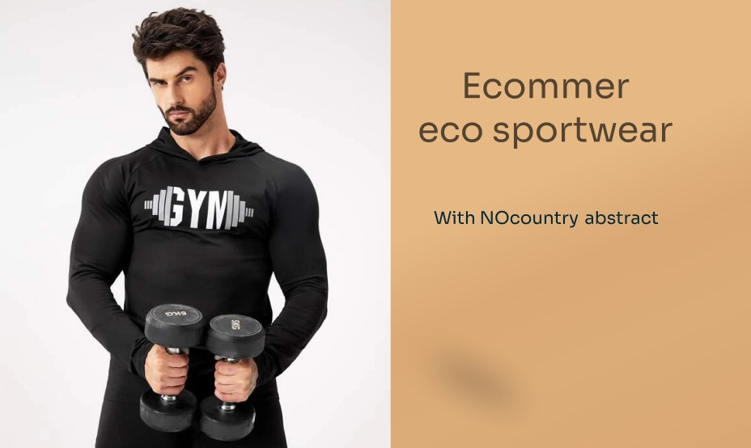

# S4-06-M-JAVA-REACT // Eco Sportwear

# Contenido General del Sitio:

- "Login" para registrase e iniciar sesion.
- Carrito de compras.
- Seleccion de productos.
- Landing Page con variedad de productos a seleccionar.
- Proceso de pago.
- Herramienta de Administrador.

## TECNOLOGIAS EN FRONT

- ✅ React
- ✅ Context
- ✅ JavaScript
- ✅ Styled Component
  .  
  .

## TECNOLOGIAS EN BACK

- ✅ Java-11
- ✅ Spring boot 2.7.4
- ✅ IomBok
- ✅ Builder
- ✅ Spring Security
- ✅ Programacion Funcional
- ✅ Arquitectura en capas MVC
- ✅ Swagger
- ✅ JWT Token

.
.
.

# Demo:

Si deseas puedes probar el funcionamiento del sitio desde el siguiente link: <u>Viaja al Demo</u> ✈️

.
.

# Integrantes:

- Diana Zambrano (_`UX/UI`_)
- Cristian Mosquera (_`Front end`_)
- Santiago Schroh (_`Front end`_)
- Gabriel Navarro (_`Back end`_)
- Abel Acevedo (_`Back end`_)
